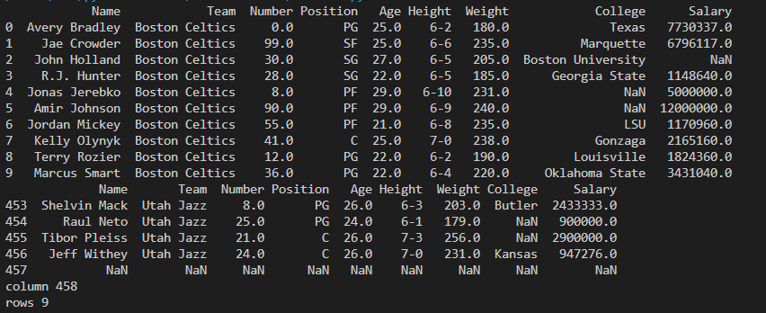

# Read-from-CSV

## AIM:
To write a program to read from a csv file

## ALGORITHM:

### Step 1:
import pandas library
### Step 2:
Raed the csv file using df = pd.read_csv('nba.csv')
### Step 3:
print the head and tail and column and rows
### Step 4:
print the output
### Step 5:
End the program

## PROGRAM:
Developed by: Soundariyan M N

Register no: 22008347

```python
import pands as pd
df = pd.read_csv('nba.csv')
print(df.head(10))
print(df.tail())
print("column",len(df.axes[0]))
print("rows".len(df.axes[1]))
```

## OUTPUT:


## RESULT:

Thus a program to read from a csv file has been written successfully
